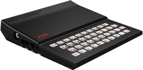
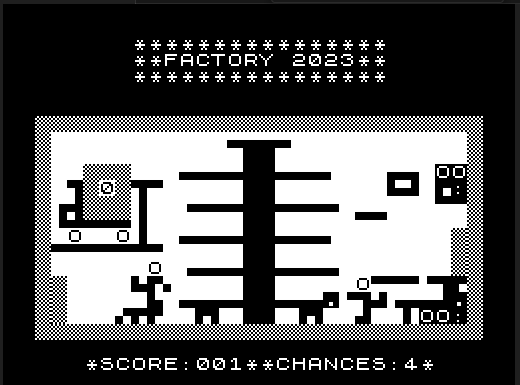
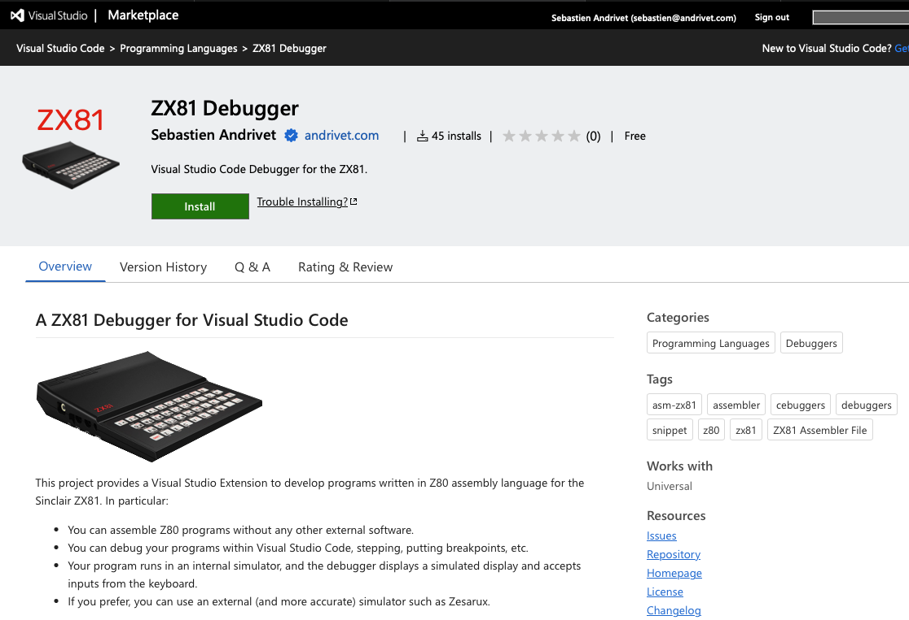
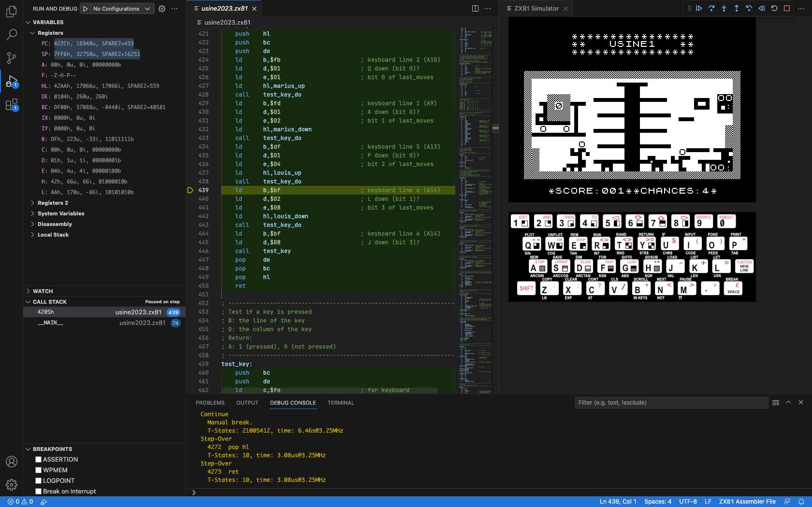

# FACTORY 203 - A Game for ZX81 and compatible computers

## Some History

The Sinclair ZX81 was my first computer, in 1982. Around 1984, I made some games for this computer. Most of the time, it was the recreation of popular games. One of these games was called USINE in French, FACTORY in English, and involved two brothers in a factory.

It was great but suffered from a bug: when you pressed a key to move one of the brothers, it was not always taken into account, and because of that, you lost the game. Kind of frustrating.

Time passed, and I lost the sources of the game (those sources were never in electronic form but only on paper). Fortunately, I sold the game around 1985 to a journal, and it was published in 1986. Some people took the time to type it again, and I was able to recover the binary. But even after some disassembly, a binary is far from a usable source code. I recently had the occasion to work on this game again. But out of the question to work on paper and assemble the code by hand this time. I want to use modern tools, a good editor, Z80 assembler, and a debugger. So I created two projects: A [Z80 assembler written in Typescript](https://github.com/andrivet/z80-assembler) and an [extension for Visual Studio Code called ZX81-Debugger](https://marketplace.visualstudio.com/items?itemName=andrivet.zx81-debugger).

With those tools, I was able to reverse-engineer my own old code and fix the bug (it was a conception problem). I also take the time to restructure the code, remove all parts in BASIC, and document the code. This code is available in this repository.

## How to play

There are several ways to play:

* The game is available in binary form (.P file) in this repository. You can load it into your favorite ZX81 emulator, such as [ZEsarUX](https://github.com/chernandezba/zesarux).
* The game is included in the [ZX81 emulator for iOS and iPadOS](https://apps.apple.com/ch/app/zx81/id1180117434).
* You can run it in the [ZX81 Debugger]((https://marketplace.visualstudio.com/items?itemName=andrivet.zx81-debugger)
* You can [run it in your browser](https://www.andrivet.com/static/ZX81/) using my [ZX81 Typescript Emulator](https://github.com/andrivet/zx81-typescript-emulator).

The game uses the following keys:

* **Q** - Move left brother (Marius) up
* **A** - Move left brother (Marius) down
* **P** - Move right brother (Louis) up
* **P** - Move right brother (Louis) down
* **J** - Exit the game

## How to debug the game

* Install [Visual Studio Code](https://code.visualstudio.com/download) (Windows, Linux or macOS).
* Install the [ZX81-Debugger extension](https://marketplace.visualstudio.com/items?itemName=andrivet.zx81-debugger) in Visual Studio Code.
* Clone or download this repository.
* In Visual Studio Code, open the folder containing the files.
* Open the `factory2023.zx81` file (double-click on its name on the left)
* Click on the **Run and Debug** icon in the Action bar (on the left)
* Click on the **Run and Debug** button to start debugging.

## Copyrights

* **FACTORY** Copyright &copy; 1984-2023 Sebastien Andrivet.
* [ZX81-Debugger](https://github.com/andrivet/ZX81-Debugger), Copyright &copy; 2023 Sebastien Andrivet.
* [Z80 Assembler in Typescript Library](https://github.com/andrivet/z80-assembler), Copyright &copy; 2023 Sebastien Andrivet.
* [DeZog](https://github.com/maziac/DeZog), Copyright &copy; Thomas Busse.
* [Z80.js simulator](https://github.com/DrGoldfire/Z80.js) Copyright &copy; Molly Howell
* ZX81 ROM Copyright &copy; 1981 Nine Tiles.
